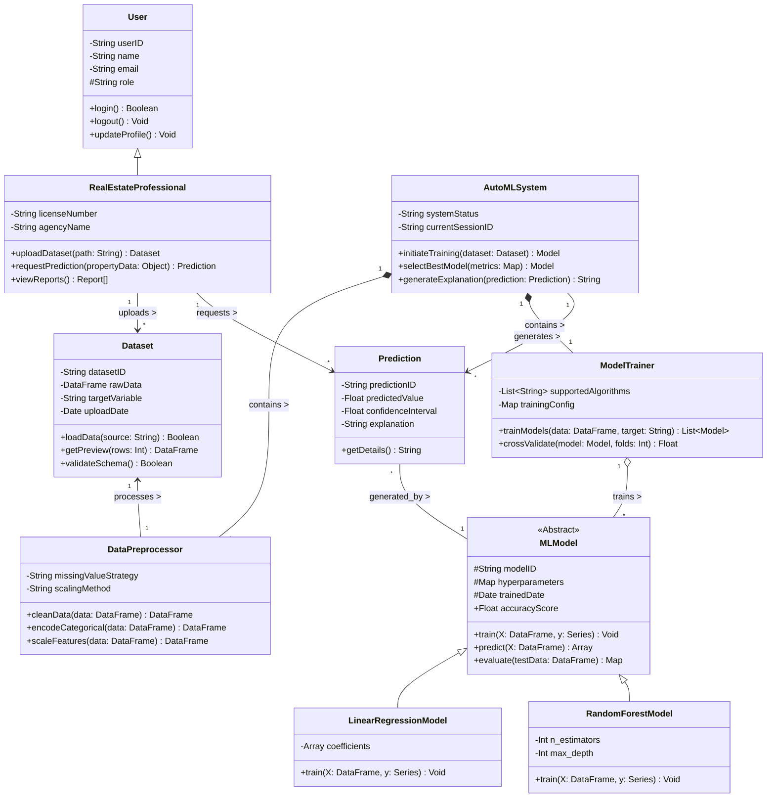

# Part B: Structural Aspects of the Software

This document covers the structural modeling of the Real Estate AutoML System using UML Class Diagrams.

---

## Q1. Identify Key Classes, Attributes, and Functionalities

Below are the key classes identified for the system, along with their attributes and methods.

**Visibility Key:**
- `+` Public
- `-` Private
- `#` Protected

### 1. **User** (Abstract Base Class)
Represents a generic user of the system.
- **Attributes:**
  - `- userID: String`
  - `- name: String`
  - `- email: String`
  - `# role: String`
- **Methods:**
  - `+ login(): Boolean`
  - `+ logout(): Void`
  - `+ updateProfile(): Void`

### 2. **RealEstateProfessional** (Inherits from User)
The primary actor using the system.
- **Attributes:**
  - `- licenseNumber: String`
  - `- agencyName: String`
- **Methods:**
  - `+ uploadDataset(path: String): Dataset`
  - `+ requestPrediction(propertyData: Object): Prediction`
  - `+ viewReports(): Report[]`

### 3. **Dataset**
Manages the uploaded data for training.
- **Attributes:**
  - `- datasetID: String`
  - `- rawData: DataFrame`
  - `- targetVariable: String`
  - `- uploadDate: Date`
- **Methods:**
  - `+ loadData(source: String): Boolean`
  - `+ getPreview(rows: Int): DataFrame`
  - `+ validateSchema(): Boolean`

### 4. **AutoMLSystem** (Controller / Facade)
The main controller orchestrating the entire AutoML process.
- **Attributes:**
  - `- systemStatus: String`
  - `- currentSessionID: String`
- **Methods:**
  - `+ initiateTraining(dataset: Dataset): Model`
  - `+ selectBestModel(metrics: Map): Model`
  - `+ generateExplanation(prediction: Prediction): String`

### 5. **DataPreprocessor**
Handles data cleaning and transformation.
- **Attributes:**
  - `- missingValueStrategy: String`
  - `- scalingMethod: String`
- **Methods:**
  - `+ cleanData(data: DataFrame): DataFrame`
  - `+ encodeCategorical(data: DataFrame): DataFrame`
  - `+ scaleFeatures(data: DataFrame): DataFrame`

### 6. **ModelTrainer**
Responsible for training various machine learning models.
- **Attributes:**
  - `- supportedAlgorithms: List<String>`
  - `- trainingConfig: Map`
- **Methods:**
  - `+ trainModels(data: DataFrame, target: String): List<Model>`
  - `+ crossValidate(model: Model, folds: Int): Float`

### 7. **MLModel** (Abstract / Interface)
Represents a generic machine learning model.
- **Attributes:**
  - `# modelID: String`
  - `# hyperparameters: Map`
  - `# trainedDate: Date`
  - `+ accuracyScore: Float`
- **Methods:**
  - `+ train(X: DataFrame, y: Series): Void`
  - `+ predict(X: DataFrame): Array`
  - `+ evaluate(testData: DataFrame): Map`

### 8. **LinearRegressionModel** (Inherits from MLModel)
Concrete implementation of a specific algorithm.
- **Attributes:**
  - `- coefficients: Array`
- **Methods:**
  - `+ train(X: DataFrame, y: Series): Void`

### 9. **RandomForestModel** (Inherits from MLModel)
Another concrete implementation.
- **Attributes:**
  - `- n_estimators: Int`
  - `- max_depth: Int`
- **Methods:**
  - `+ train(X: DataFrame, y: Series): Void`

### 10. **Prediction**
Represents the result of a prediction request.
- **Attributes:**
  - `- predictionID: String`
  - `- predictedValue: Float`
  - `- confidenceInterval: Float`
  - `- explanation: String`
- **Methods:**
  - `+ getDetails(): String`

---

## Q2. UML Class Diagram with Relationships

The diagram below illustrates the relationships between the classes identified above.

**Relationships Key:**
- **Inheritance**: `User <|-- RealEstateProfessional`, `MLModel <|-- LinearRegressionModel`
- **Composition**: `AutoMLSystem *-- DataPreprocessor` (Strong lifecycle dependency)
- **Aggregation**: `ModelTrainer o-- MLModel` (Trainer uses models, but models can exist independently in registry)
- **Association**: `RealEstateProfessional --> Dataset` (Uses)

