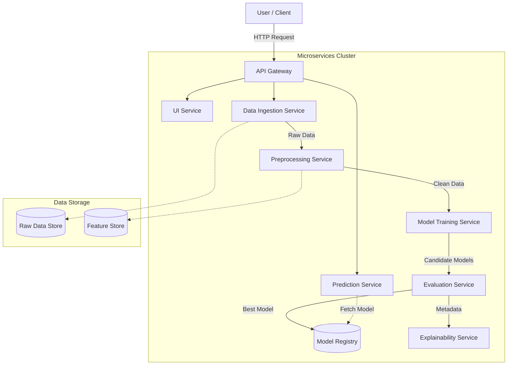
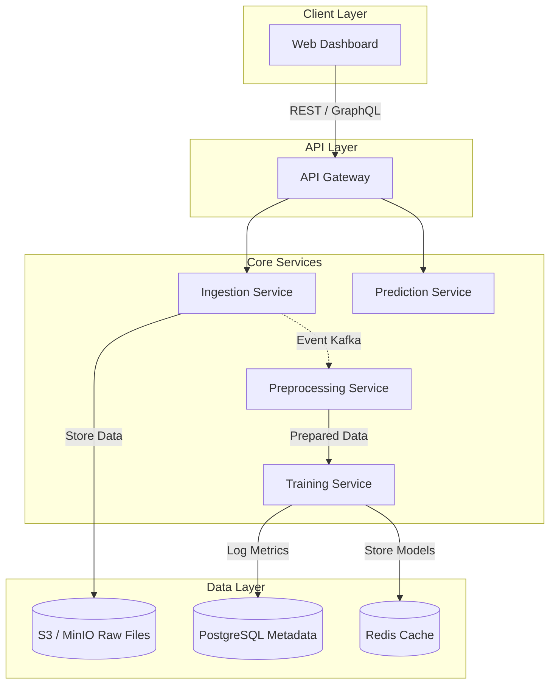

# Lab 4: Software Architecture Style

## I. Chosen Architecture Style: Microservices Architecture

For the **AutoML Platform for Model Selection and Training**, the **Microservices Architecture** is the most appropriate choice. This style structures the application as a collection of loosely coupled services, which is ideal for the distinct and independent functionalities of an AutoML system.

### A. Justification by Granularity of Software Components

The AutoML platform can be naturally decomposed into fine-grained, independent services, each responsible for a specific domain of the machine learning workflow.

*   **User Interface (UI) Service**: Handles user interactions, dashboard rendering, and file uploads. It communicates with backend services via API gateways.
*   **Data Ingestion Service**: Responsible for receiving raw datasets, validating formats (CSV, Excel), and storing them in a raw data storage (e.g., S3 or a database).
*   **Data Preprocessing Service**: Cleans data, handles missing values, encodes categorical variables, and normalizes features. This service is compute-intensive and operates independently of the UI.
*   **Model Training Service**: The core engine that trains multiple algorithms (Regression, Random Forest, etc.) in parallel. It uses the preprocessed data to generate candidate models.
*   **Model Evaluation Service**: Tests the trained models against validation datasets using metrics like RMSE, Accuracy, etc., and selects the best-performing model.
*   **Prediction Service**: Exposes the best model to generate predictions for new input data. It needs to be highly available and low-latency.
*   **Explainability Service**: specialized service that analyzes the model to provide feature importance and decision explanations.

### B. Justification for Best Choice

Microservices Architecture is the best choice for this project due to the following reasons:

*   **Scalability**:
    *   Different components of an AutoML system have vastly different resource needs. The **Model Training Service** is CPU/GPU intensive and may need to scale up significantly during training jobs, whereas the **UI Service** is lightweight.
    *   Microservices allow us to scale *only* the training service (e.g., adding more worker nodes) without scaling the entire application, optimizing resource usage and cost.

*   **Maintainability**:
    *   The project involves distinct domains (data processing, ML algorithms, web UI). Separate teams or developers can work on the **Preprocessing Service** (using Python/Pandas) without affecting the **UI Service** (using React/Node.js).
    *   Fault isolation ensures that if the *Training Service* crashes due to a memory error, the *UI* and *Prediction Service* remain operational.

*   **Performance**:
    *   Long-running tasks like model training can be processed asynchronously without blocking the user interface.
    *   The **Prediction Service** can be optimized for low latency (e.g., using C++ or optimized inference runtimes) independent of the training logic.

*   **Technology Heterogeneity**:
    *   ML components are best written in **Python** (scikit-learn, TensorFlow), while the web backend might be better suited for **Node.js** or **Go**. Microservices allow each component to use the best tool for the job.

## II. Application Components

The software engineering project consists of the following key application components:

### 1. Frontend (Web Application)
*   **Description**: A responsive web interface built using **React.js** or **Vue.js**.
*   **Responsibility**:
    *   Allows users to upload datasets (CSV/Excel).
    *   Provides a dashboard for selecting target variables and viewing model training progress.
    *   Visualizes predictions and explainability reports (charts, graphs).
    *   Communicates with the backend via REST APIs.

### 2. API Gateway
*   **Description**: The entry point for all client requests, acting as a reverse proxy (e.g., **NGINX**, **Kong**).
*   **Responsibility**:
    *   Routes requests to appropriate microservices.
    *   Handles authentication and rate limiting.
    *   Aggregates responses from multiple services to reduce round-trips.

### 3. Backend Services (Microservices)
These are the core independent services implementing the business logic:
*   **Data Ingestion Service**: Validates and stores raw uploaded files.
*   **Preprocessing Service**: Performs data cleaning, imputation, and feature scaling.
*   **AutoML Engine (Training Service)**: Orchestrates model selection and hyperparameter tuning. It spawns worker processes to train models like Linear Regression, Random Forest, and XGBoost.
*   **Evaluation Service**: Computes metrics (RMSE, MAE, R2 for regression; Accuracy, F1-score for classification) to rank models.
*   **Prediction Service**: A high-performance service for serving real-time or batch predictions using the best-selected model.

### 4. Data Storage Components
*   **Raw Data Store**: Object storage (safe & scalable) like **AWS S3** or **MinIO** for storing large dataset files.
*   **Metadata Database**: A relational database (e.g., **PostgreSQL**) to store user info, project metadata, model configurations, and training logs.
*   **Model Registry**: A dedicated storage for serialized model artifacts (e.g., `.pkl`, `.h5` files), often versioned (e.g., **MLflow**).
*   **Feature Store**: Optional high-speed storage (e.g., **Redis**) to serve precomputed features for low-latency inference.

### 5. Message Queue / Event Bus
*   **Description**: An asynchronous communication backbone (e.g., **Kafka**, **RabbitMQ**).
*   **Responsibility**:
    *   Decouples services. for example, the *Ingestion Service* publishes a "DataUploaded" event, which triggers the *Preprocessing Service*.
    *   Ensures reliability by buffering tasks if the training workers are busy.

### Component Interaction Diagram

